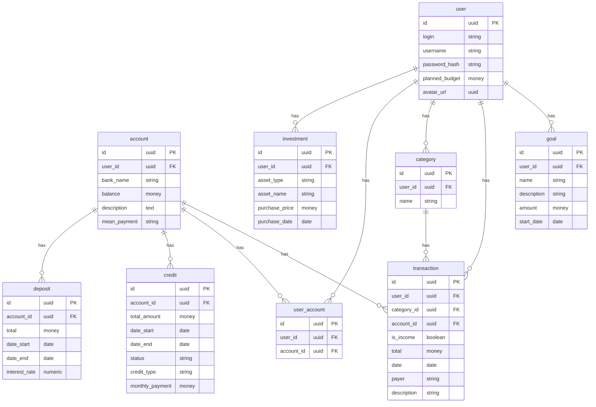

# Описание Таблиц
## User
- Хранит информацию о пользователях.
- {id} -> {username, login, password_hash, planned_budget, avatar_url}
- {login}->{id, username, password_hash, planned_budget, avatar_url}
## Account
- Хранит информацию о банковских счетах пользователя.
- {id} -> {user_id, balance, mean_payment}
- {user_id} -> {id, balance, mean_payment}
## Investment
- Хранит информацию о инвестициях пользователя.
- id -> {name, total, date start, price, percentage}
## Category
- Хранит информацию о категориях транзакций.
- {id} -> {user_id, name}
## Transaction
- Хранит информацию о транзакциях пользователя.
- {id} -> {user_id, category_id, account_id, total, is_income, date, payer, description}
## Goal
- Хранит информацию о финансовых целях пользователя.
- {id} -> {user_id, name, description, total, date}
## UserAccount
- Служит для связи таблиц Users и Accounts.
- {id} -> {user_id, account_id}
## Deposit
- Хранит информацию о вкладах
- {id} -> {account_id, total_amount, start_at, end_at, interest_rate}
## Credit
- Хрнит информаци о кредитах на аккаунте на аккаунте
- {id} -> {account_id, amount, date_start, date_end, status, credit_type, monthly_payment}
## Debt
- {id} -> {user_id, total, date, status, description, creditor}

